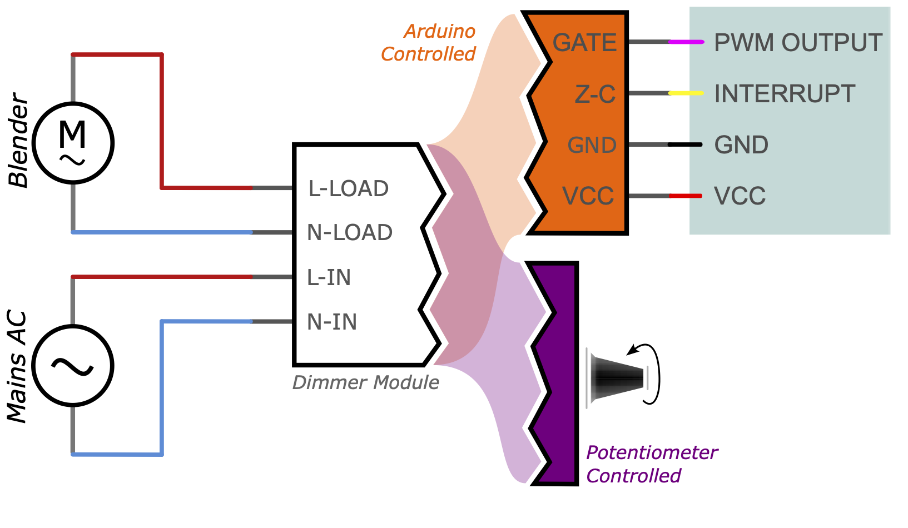
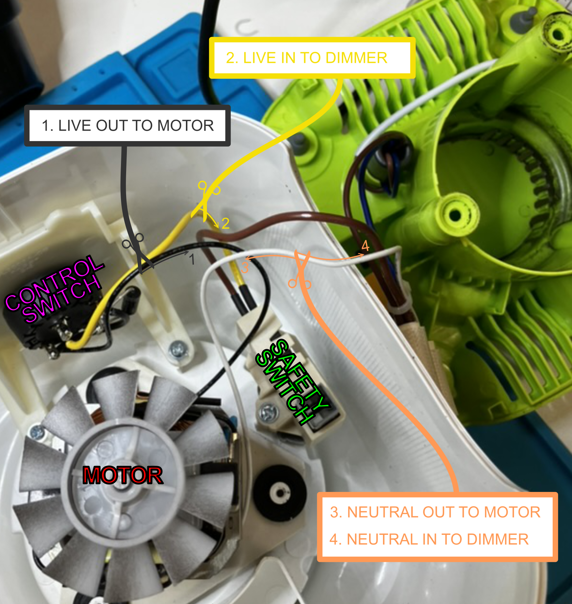
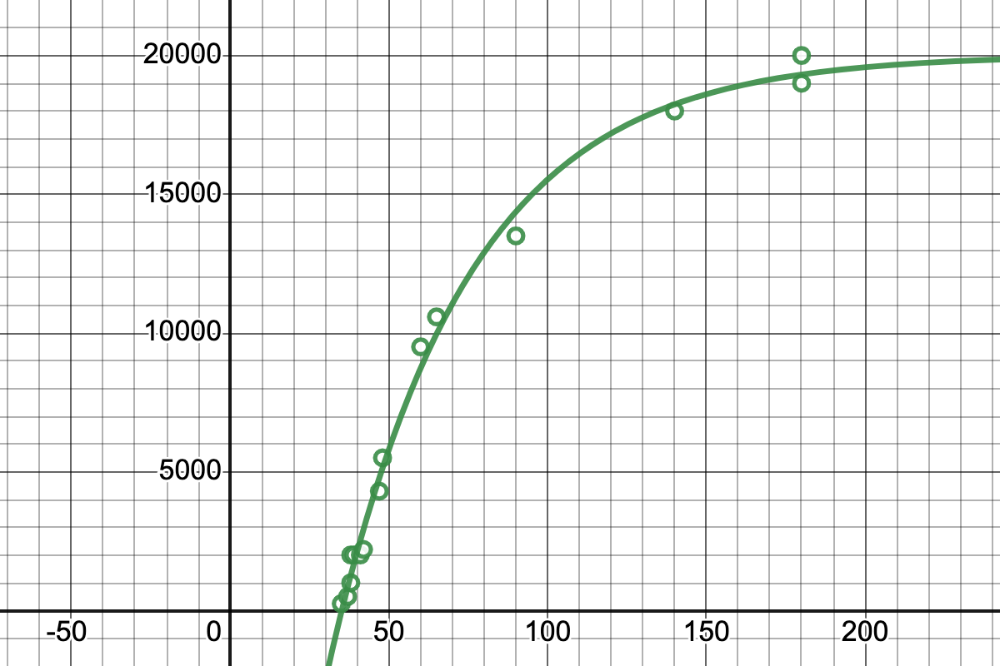
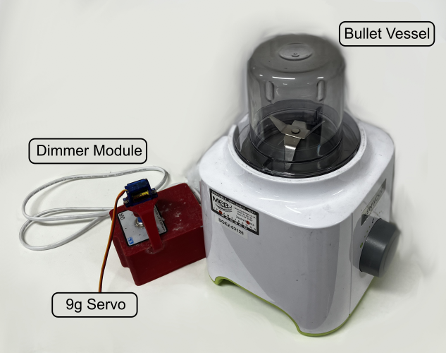

# Build Instructions and Notes

### Operating Principles

This project involves the [phase-angle control](https://electricalacademia.com/electronics/scr-thyristor-phase-control-circuit/) of AC signals. this allows for accurate power delivery but it is important to remember that rotational speed of the blender $\neq$ power.

_Very basic wiring of a dimmer module with potentiometer control or arduino control, depending on the circuit._

This particular build is a step between potentiometer and arduino control, as the dimmer module comes in two parts; a screen with tactile switches effectively acting as an arduino, and a dimmer module with an arduino interface. The markings on the back of the screen state SCR (GATE), ZERO (Z-C), GND and 5V (VCC). So effectively one could replace the screen with an arduino to achieve Phase Angle Control directly.

Note also, that I found it possible to measure the speed simply from the noise given off by the blender with the [spectroid app for android](https://play.google.com/store/apps/details?id=org.intoorbit.spectrum). Will take some work to recognise which signals are which, but if you are uninterested in exact speed, you can make the setup more repeatable by aiming for previously obtained resonant frequencies!

##### Phase Angle Control

Phase angle control, is a method of controlling the duty cycle of an AC signal every half cycle. This typically uses a triode called a triac sometimes also called a Silicon Controlled Rectifier (SCR) or a Thyristor, and you will often see these terms banded around when shopping circuitry. The circuit is similar to what you would find in a dimmer switch in a house, hence sometimes it is called a dimmer or dimming circuit.

The main advantages to this type of rectification compared to other similar functioning circuits is that:

1. It does not disapate very much energy.
2. Simple to implement.
3. Duty cycle is small for mains AC (100% $\sim 10\;ms$), so the power delivery is pretty constant (no flickering).

_Simple representation of phase angle control._

The AC signal in potentiometer controlled cases is routed through a voltage divider which feeds into the GATE pin of the Triac. The exact electronics and some of the issues surrounding these circuits is well discussed in [this article](https://eepower.com/technical-articles/alternating-current-ac-load-control-with-triacs/#). In arduino controlled units, there will be some sort of isolation between the low and high voltage side, primarily through the use of an optocoupler or [similar circuitry](https://www.circuitar.com/nanoshields/modules/triac/).

## Bill of Materials

|Item                        |Link                                                                           |Qty|Price per Unit|Cost    |Description                                                 |
|----------------------------|-------------------------------------------------------------------------------|---|--------------|--------|------------------------------------------------------------|
|Kenwood BLP31.D0WG          |https://www.argos.co.uk/product/8132303                                        |1  |£53.00        |£53.00  |Decent blender with good power output at a nice price point.|
|United Automation QVR-TB-RFI|https://uk.rs-online.com/web/p/thyristors/2143963                              |1  |£64.30        |£64.30  |Overkill SCR circuit with potentiometer control.            |
|Heat Shrink                 |                                                                               |-  |-             |-       |To protect soldered collections.                            |
|Soldering iron              |                                                                               |-  |-             |-       |Solder wires together.                                      |
|Red wire 20 awg ~ 300 mm    |https://www.amazon.co.uk/Electrical-Wire-AWG-Extension-Brightfour/dp/B07CGKCJFV|-  |-             |-       |Live wiring, of good gauge to handle the current.           |
|Black wire 20 awg ~ 300 mm  |https://www.amazon.co.uk/Electrical-Wire-AWG-Extension-Brightfour/dp/B07CGKCJFV|-  |-             |-       |Neutral wiring, of good gauge to handle the current.        |
|CAD/Upper.step       |                                                                               |-  |-             |-       |To isolate the live AC and be a little safer.               |
|CAD/Lid.step   |                                                                               |-  |-             |-       |To isolate the live AC and be a little safer.               |
|M4 countersink 15 mm        |https://uk.rs-online.com/web/p/socket-screws/0171837                           |4  |£0.20         |£0.80   |To bolt the potentiometer box lid shut.                     |
|                            |                                                                               |   |              |£118.10 |                                                            |

## Mods

There are no direct modifications to the blender itself, apart from wiring in the dimmer module. In my case, I decided to remove the connections to the main switch dial at the front of the blender, as it didn't add any extra security or control to the blender.

Note that there are much cheaper [pot dimmer circuits](https://www.amazon.co.uk/AITRIP-Control-Controller-Adjustable-Regulator/dp/B08L7NF4Q9) available (at £4.50 a pop), but we decided to go with the overkill option to save any potential headaches. With pot blenders, you can't exactly return to the same power setting unless you have some readout to go with it, for example, a frequency, a precise angle or a power reading. There are [modules](https://www.amazon.co.uk/gp/product/B076VKJM42) which have digital readouts for a more precise reading. Again it is important to stress that precise power $\neq$ precise speed reading.

### Wiring

1.	Unsolder the black wire from the motor to the control switch. This lead is the LIVE AC OUT (**L AC-MOTOR**) to the motor.
2. Unsolder the Yellow Wire from the control switch. This is the LIVE AC IN (**L AC-IN**) to the dimmer.
    
    At this point, the control switch is completely bypassed, but the safety switch isn't. I prefer to keep the safety switch wired in, as it ensures the blender is not live when the jug isnt plugged in.
    
    During my testing, position "P" and "2" on the dial were a simple on off switch (for full AC Power), while position "1" cut the negative half of the waveform.
    
3. The white wire is neutral mains, wired directly to the motor. Cut the wire roughly halfway. This is NEUTRAL AC OUT (**N AC-MOTOR**) to the motor.
4. The other side of the wire cut cut in step 3 is NEUTRAL AC IN (**N AC-IN**) to the Dimmer.

You'll need about half a meter of suitable guage wiring to extend these wires out of the blender. These will take a bit of current, so ensure they are soldered well.

### Printing

CAD files for printing the box are given in the `CAD` folder. There's not much to go into here, as the box offers no extra safety except to hide the wired connection points.

## Arduino Code

_Servo angle (x) against rotor speed (y). Notice the sharp dip in speed around_ $\theta$ _= 50 rpm This explains why speed is unreliable here; Small changes at low power settings make the speed very touchy and sensitive to position._

I have since added a small 9g servo to the top of the box to operate the dial (which allows for on-off cycling). As it doesn't affect the main electronics, I'll add the code used to operate it in the code folder. The data is [on desmos](https://www.desmos.com/calculator/bqjuhv8qqg) if you're looking to play around with it.

The addition of the servo is very simple, so I won't get into the details (as there is not much to get into), but consists of adding a mounting arm to the top of the box and a coupling for the servo arm to attatch directly to the potentiometer secured in with a little contact adhesive.

_Potentiometer blender with added servo._
