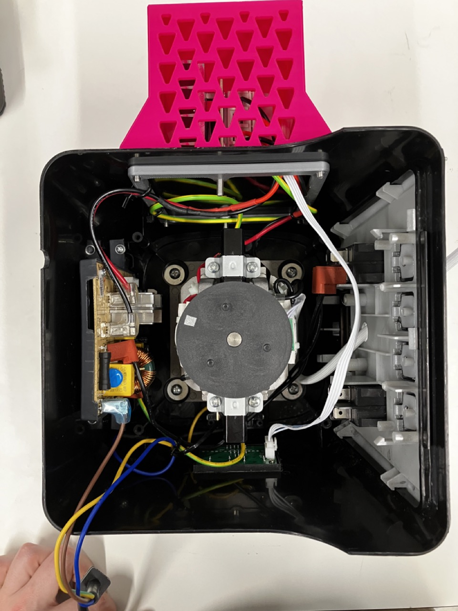

# Build Instructions and Notes

### Operating Principles

This project involves the [phase-angle control](https://electricalacademia.com/electronics/scr-thyristor-phase-control-circuit/) of AC signals. this allows for accurate power delivery but it is important to remember that rotational speed of the blender $\neq$ power.

_Very basic wiring of a dimmer module with potentiometer control or arduino control, depending on the circuit._

This particular build is a step between potentiometer and arduino control, as the dimmer module comes in two parts; a screen with tactile switches effectively acting as an arduino, and a dimmer module with an arduino interface. The markings on the back of the screen state SCR (GATE), ZERO (Z-C), GND and 5V (VCC). So effectively one could replace the screen with an arduino to achieve Phase Angle Control directly.

Note also, that I found it possible to measure the speed simply from the noise given off by the blender with the [spectroid app for android](https://play.google.com/store/apps/details?id=org.intoorbit.spectrum). Will take some work to recognise which signals are which, but if you are uninterested in exact speed, you can make the setup more repeatable by aiming for previously obtained resonant frequencies!

##### Phase Angle Control

Phase angle control, is a method of controlling the duty cycle of an AC signal every half cycle. This typically uses a triode called a triac sometimes also called a Silicon Controlled Rectifier (SCR) or a Thyristor, and you will often see these terms banded around when shopping circuitry. The circuit is similar to what you would find in a dimmer switch in a house, hence sometimes it is called a dimmer or dimming circuit.

The main advantages to this type of rectification compared to other similar functioning circuits is that:

1. It does not disapate very much energy.
2. Simple to implement.
3. Duty cycle is small for mains AC (100% $\sim 10\;ms$), so the power delivery is pretty constant (no flickering).

_[Simple representation of phase angle control.](https://www.libratherm.com/phase-angle-control-vs-zero-crossover-control/)_

The AC signal in potentiometer controlled cases is routed through a voltage divider which feeds into the GATE pin of the Triac. The exact electronics and some of the issues surrounding these circuits is well discussed in [this article](https://eepower.com/technical-articles/alternating-current-ac-load-control-with-triacs/#). In arduino controlled units, there will be some sort of isolation between the low and high voltage side, primarily through the use of an optocoupler or [similar circuitry](https://www.circuitar.com/nanoshields/modules/triac/).

The original circuitry on the blender used here is a less precise "Burst firing" control, where multiple periods of AC are allowed through at a time, effectively meaning the regulation cycle is much longer than that achievable by Phase angle Control.

## Bill of Materials

|Item                   |Link                                                                                 |Qty|Price per Unit|Cost   |Description                                                               |
|-----------------------|-------------------------------------------------------------------------------------|---|--------------|-------|--------------------------------------------------------------------------|
|AMZChef NY-8088MJD     |https://www.amazon.co.uk/Smoothie-AMZCHEF-Commercial-Container-25000RPM/dp/B08CKTB6Z4|1  |£150.00       |£150.00|Top of the line commercial blender, resistant to some solvents.           |
|Walfront Dimmer Circuit|https://www.amazon.co.uk/Digital-Voltage-Regulator-Control-Thermostat/dp/B076VKJM42  |1  |£17.43        |£17.43 |Easy to use, and has the potential for wiring in a separate board.        |
|Heat Shrink            |                                                                                     |-  |-             |-      |To protect soldered collections.                                          |
|Soldering iron         |                                                                                     |-  |-             |-      |Solder wires together.                                                    |
|Red wire 20 awg        |https://www.amazon.co.uk/Electrical-Wire-AWG-Extension-Brightfour/dp/B07CGKCJFV      |-  |-             |-      |Live wiring, of good gauge to handle the current.                         |
|Black wire 20 awg      |https://www.amazon.co.uk/Electrical-Wire-AWG-Extension-Brightfour/dp/B07CGKCJFV      |-  |-             |-      |Neutral wiring, of good gauge to handle the current.                      |
|3DP Bolt-on box        |                                                                                     |-  |-             |-      |To isolate the live AC and be a little safer, also allow a little airflow (Both printed components are contained in the same .f3d archive file).|
|3DP Backing Plate      |                                                                                     |-  |-             |-      |To eliminate the need for nuts to fix in the bolt-on box (Both printed files are contained in the same .f3d archive file).                 |
|M4 countersink 15 mm   |https://uk.rs-online.com/web/p/socket-screws/0171837                                 |6  |£0.20         |£1.20  |To bolt the backing plate to the Dimmer and                                                      |
|                       |                                                                                     |   |              |£168.43|                                                                          |

## Mods

There are no direct modifications to the blender itself, apart from wiring in the dimmer module. In this case, a little fitting is needed in order for everything to sit nicely within the blender.

Firstly, we removed the blender control board from the front of the blender, effectively removing any interference from the on-board electronics, this can then be discarded. In this blender, there is a bespoke power management IC in order to power the blender and the control board. We do not require this board for the blender to function, so it can be removed, we opted for it to stay in there, as it gives us some flexibility to use the on-board switches later. Much like in the previous version, we're looking to follow the same steps as the v1 blender, by wiring the dimmer module between the motor and mains AC.

### Wiring

_Blender with modifications, opened from above._

In the above; Live (brown), Ground (Yellow), Neutral (Blue) are routed into the blender from the bottom left. Neutral and Live are wired into the power IC (left side of the blender), while ground is connected to the cast motor mounting. The signal is filtered, passed through the main switch (right side of the blender) and then fed back into the power IC.

After, Live and Neutral are routed to the top of blender through a hole to the dimmer module on that side (obscured by the 3D printed bolt-on box). Ground is also wired through to the Dimmer module so that the electronics share a common ground.

_Dimmer module, mounted to the side of the blender_

Motor live, motor neutral, mains live and mains neutral (after passing through the power management IC) are all passed into the board, and the board is grounded using one of the two M4 countersink bolts used to attatch the dimmer module to the blender. The control signal is passed via the white cable down to the screen module, which is glued in place (bottom of the blender in the first image of this section). The 3D printed enclosure sits above and is fixed in place using 4 M4 countersink bolts.s

### Future Modifications

_Builtin Hall-Effect Sensor, with two magnets, should allow for very precise speed measurements up to high rpms._

As noted before, there stands a lot to be modified with this setup, it offers a range of features including on-board power management and speed sensing, and with a small amount of effort, could be made into a completely autonomous blender.