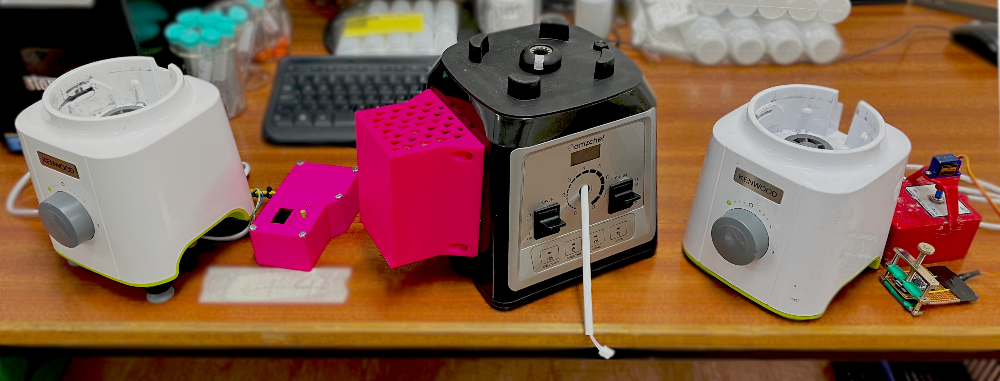

# Triac Blender
_Blender with Triac v1, Build Notes. Part of the Open Science Framework repository [OpenLPE](https://osf.io/evupy/)_

_From right to left, Triac-Blender v1, Triac-Blender v2, PID-Blender._

### Background \& Motivation

_This is part of the [OpenLPE](https://osf.io/evupy/) labware project._

There are no reasonably priced commercial blenders with adequate speed control for practical experiments. The closest is the [Waring LB20ES](https://www.thelabstore.co.uk/waring-lb20es-variable-speed-control-blender-1-0-litre-stainless-steel-container-230v-50-hz-ce-approved-rohs-with-european-f-schuko-plug.html), being over £1000. This left us feeling priced out, so we had to come up with an alternative, which is this Triac modification, enabling for great power selectivity. Speed on this version is much more repeatable and reliable as we are selectively controlling how much power is delivered, which cures a lot of the problems of the v1 blender. The issue here is that there is no On/Off functions

The blenders I have been controlling range between $600$ $W$ to $2$ $kW$ peak power, which they can sustain for a maximum of $\approx 1$ $min$ before they get dangerously hot (and melt-y). Some come with automatic sensors to detect when they are overheating and shut-off automatically to save the motor. From my testing, I recommend following the manufacturer's recommendations alternating running it for $1$ $min$ **ON** with a subsequent minimum of $1$ $min$ **OFF** to allow it to cool down.

### Disclaimer!

Playing with AC is _incredibly_ dangerous. Make sure to take all precautions when making modifications and ensure everything is unplugged and grounded.

## Potential Changes

List of changes and whether they have been implemented.

- [ ] Could add in arduino functionality at a later date.
